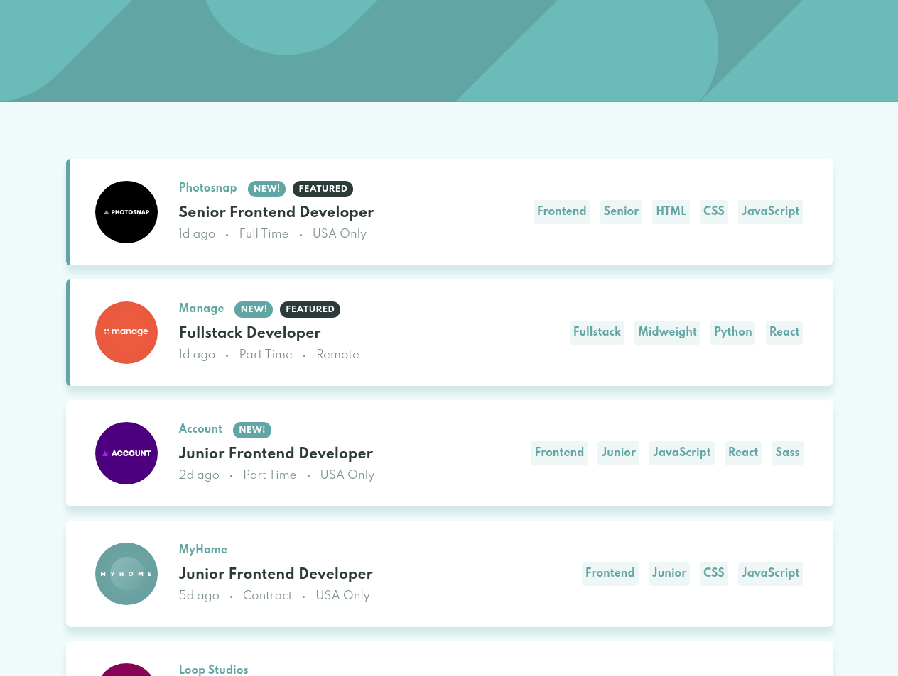
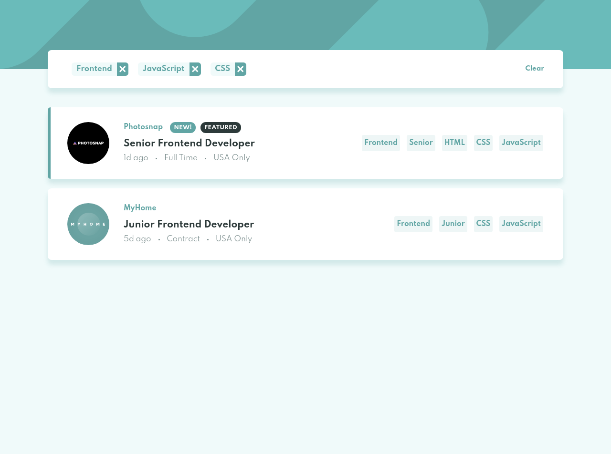
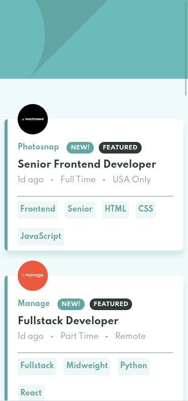
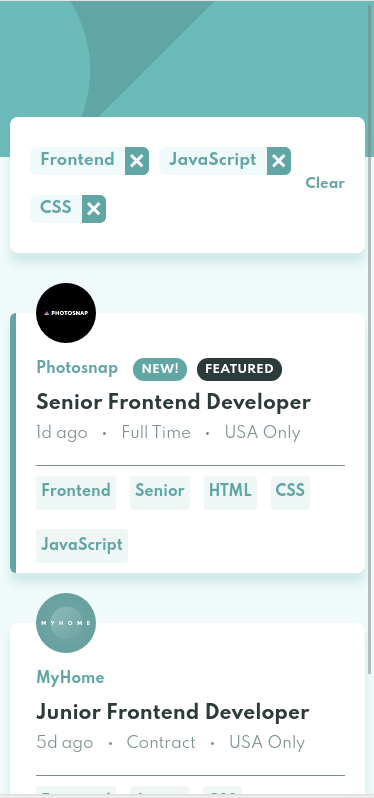

### Job Listings

> Simple React app for job listings

## Table of Contents

* [About the Project](#about-the-project)
  * [Built With](#built-with)
* [Setup](#setup)
* [Author](#author)
* [Show your Support](#show-your-support)
* [Acknowledgements](#acknowledgements)

<!-- ABOUT THE PROJECT -->
## About The Project

<h3 align="center">Desktop</h3>

<p align="center">
  
</p>

<h3 align="center">Filtered Jobs - Desktop</h3>

<p align="center">
  
</p>

<h3 align="center">Mobile</h3>

<p align="center">
  
</p>

<h3 align="center">Filtered Jobs - Mobile</h3>

<p align="center">
  
</p>

Simple React app for job listings.

Job data is fetched from the [data.json](public/data.json) file.

Users can browse through the job listings and filter the jobs by clicking on the 'tags'.

Live version of the project: [Live version](https://joblistings.netlify.app/)

Project Link: [nsoft-assignment](https://github.com/ermin-cahtarevic/nsoft-assignment)


### Built With

*   React
*   CSS
*   npm
*   ES6

## Setup

```
git clone git@github.com:ermin-cahtarevic/nsoft-assignment.git
```
### Install dependencies

```
npm install
```

### Start Development Server

```
npm start
```
### Visit this link in your browser
```
http://localhost:3000/
```

<!-- CONTACT -->
## Author

- Github: [@ermin-cahtarevic](https://github.com/ermin-cahtarevic)
- Twitter: [@ErminCahtarevic](https://twitter.com/ErminCahtarevic)
- Linkedin: [Ermin Cahtarevic](https://www.linkedin.com/in/ermincahtarevic/)

<!-- ABOUT THE PROJECT-->
## Show your support

Give a star if you like this project!

<!-- ACKNOWLEDGEMENTS -->
## Acknowledgements

* [NSoft](https://www.nsoft.com/)